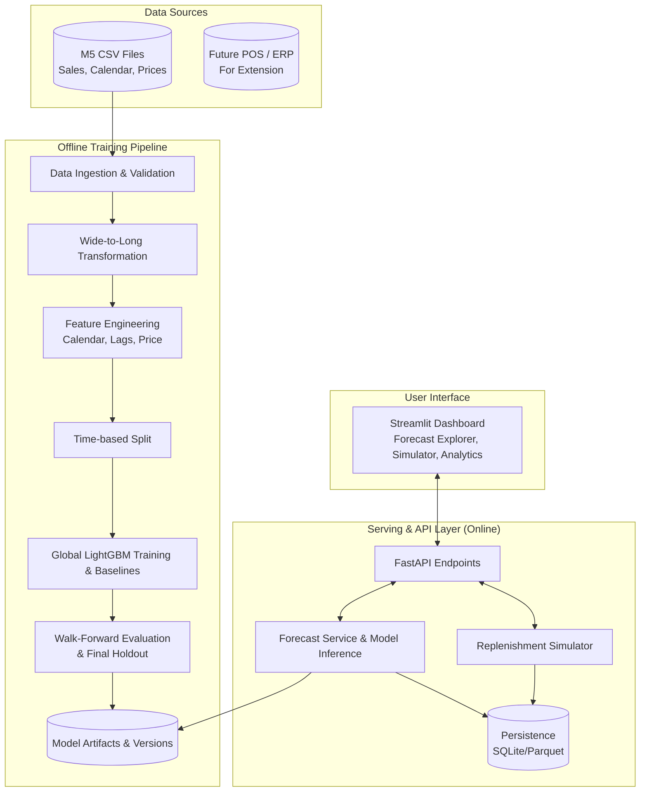
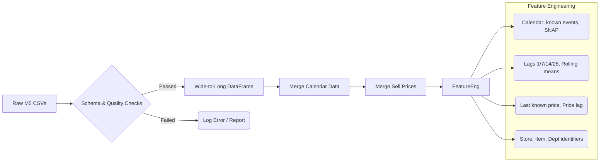
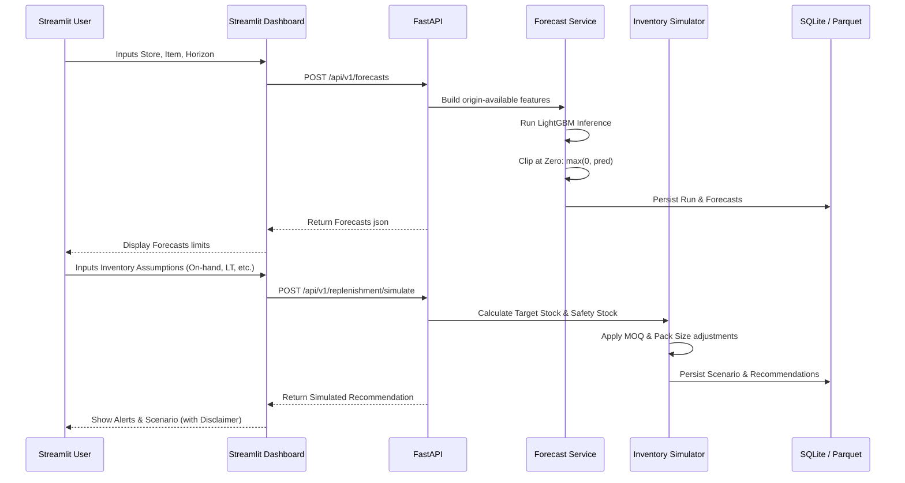

# Store-Level Demand Forecaster Architecture

This document contains the High-Level Design (HLD) and Low-Level Design (LLD) diagrams for the Store-Level Demand Forecaster system.

## High-Level Design (HLD)

The HLD illustrates the end-to-end workflow covering offline model training and the online presentation/inference layer.

## Low-Level Design (LLD)

### 1. Data & Feature Pipeline

### 2. Inference & Replenishment Flow

## Functional Components Overview

- **Storage**: M5 dataset input and SQLite/Parquet for saving forecasts and scenarios.
- **Model Training**: Extracts `sales_train_validation.csv`, validates formatting. Performs walk-forward multi-horizon forecasting `f(X_t, h) -> y_(t+h)`.
- **FastAPI Endpoints**: 
  - `GET /api/v1/health`, `GET /api/v1/model/info`, `GET /api/v1/model/metrics`
  - `POST /api/v1/forecasts` to generate a forecast request.
  - `POST /api/v1/replenishment/simulate` for custom user-parameters to simulate expected requirements.
- **Dashboard (Streamlit)**: Forecast explorer, model metrics view, configuration/scenario tuning.
